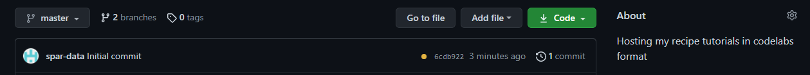

# Tools for authoring and serving codelabs
[](https://gitter.im/codelabs-base/community)

Template site is published at https://sparsh-ai.github.io/codelabs-base/.

## What is this?

Codelabs are interactive instructional tutorials, which can be authored in Jupyter notebooks and markdowns
using some simple formatting conventions. You can also author codelabs using Google docs.
This repo contains all the tools and documentation you’ll need for building and publishing
your own codelabs.

[](https://storage.googleapis.com/claat/demo.mp4)

## What's special about this tool?

* Powerful and flexible authoring flow via Jupyter notebooks and markdowns
* Optional support for authoring in Google docs
* Ability to produce interactive web or markdown tutorials without writing any code
* Easy interactive previewing
* Usage monitoring via Google Analytics
* Support for multiple target environments (kiosk, web, markdown, offline, etc.)
* Support for anonymous use - ideal for public computers at developer events
* Looks great, with a responsive web implementation
* Remembers where the student left off when returning to a codelab
* Mobile friendly user experience

## Can I use this to create my own codelabs and serve my own codelabs online?

Yes, this repo can be used by anyone to author their
own codelabs and to serve up their own codelabs on the web.

## How to prepare your Tutorial

### Setup Jupyter

We chose jupyter notebooks as an ideal choice for preparing tutorials because it integrates markdown with code, images and million other things. If you do not have a jupyter environment setup locally, you can choose [Colab](https://colab.research.google.com/) or [Binder](https://mybinder.org/v2/gh/jupyterlab/jupyterlab-demo/master?urlpath=lab/tree/demo) to prepare your notebook on cloud for free.

### Create Tutorial
Write down your tutorial in colab as per [these](https://github.com/googlecodelabs/tools/blob/master/FORMAT-GUIDE.md) markdown instructions.

## How to setup your own codelab site
*This step is a one-time setup process. We will use GitHub to maintain and host our codelab site for free.*

### Clone
Login to your git account and go to [this](https://github.com/sparsh-ai/codelabs-base) site and click ```Use this template``` button.


### Name
Give your site a name and click on ```Include all branches```.


### Let it bake

Wait for 3-4 minutes till this yellow dot becomes green. Git Actions is preparing your site in the background. Go to ```Actions``` tab to see the process.



## How to Customize your site
You can customize both landing page and codelabs. Codelab customization is mainly done via tags that we provide during the creation of jupyter notebook based tutorials.

You can customize the following items in landing page by simple modifications.
1. Change Header and Logo
2. Add Category
3. Add View
4. Change Footer

### Change Header and Logo
1. To change header and main page content, go to ```site > app > views > default``` and change ```index.html``` content as well as ```view.json``` contents accordingly.
2. To change logo, go to ```site > app > images``` and replace ```my-logo.svg``` with your logo.

Note: assuming the basic knowledge of html formattings. scope is mainly limited to find and replace things anyway.

### Add Category
1. Go to ```site > app > styles > _categories.scss``` and add your category at the bottom in this format: ```@include codelab-card(['gitaction'], $color-weave-green, 'gitaction.svg');``` where ```gitaction``` is the category.
2. Go to ```site > app > images > icons``` and add svg icon with the same name as your category.
3. To use it, while creating codelab, add this category in the ```categories``` mata tag.


### Add View
1. ```site > app > views``` and duplicate the ```medium``` folder.
2. rename the folder name to any name you want for your view.
3. Edit its json accordingly and add any image with the same name as your view.

Note: Refer to this ```medium``` folder for guidance, and delete it afterwards if required.

### Change Footer
To change footer, go to ```site > app > views > default``` and change ```index.html``` content accordingly.

## How to add new Codelabs
To add a new codelab to the codelab site, pull the repo, add the notebook and push it back to the master.

### Pull the repo
Pull the repo using ```git pull origin master``` where origin is pointed to your repo where codelabs site is hosted. If repo is already there, you can opt for ```git pull --rebase origin master``` instead.

### Add tutorial notebook
Add your tutorial notebook in the ```_notebook``` folder. Make sure the notebook format is following the codelab markdown guidelines and the extension is ```.ipynb```.

### Push the repo
Push the updated repo changes to master branch using the standard set of add -> commit -> push chain. e.g. you can use ```git add . && git commit -m 'new build' && git push origin master``` to push the changes.

Git actions workflow named ```CI``` would automatically start deploying latest changes of the master branch. You can check the status in ```Actions``` tab of your git repo.

To access the codelabs site, go to your github pages URL. The typical URL format is ```https://<user_name>.github.io/<repo_name>```.

Verify the functionality and modify/enhance the process as per requirements.

## Important resources
1. [Codelab Formatting Guide](FORMAT-GUIDE.md)
3. [Google Codelabs site](https://g.co/codelabs)
3. [Codelab Tool Official GitHub](https://github.com/googlecodelabs/tools)
4. [Check out this excellent tutorial](https://medium.com/@zarinlo/publish-technical-tutorials-in-google-codelab-format-b07ef76972cd)
5. [Check out this another tutorial](https://www.marcd.dev/codelab-4-codelab/#0)

## Acknowledgements
Google Codelabs exists thanks to the talents and efforts of many fine volunteers, including:
Alex Vaghin, Marc Cohen, Shawn Simister, Ewa Gasperowicz, Eric Bidelman, Robert Kubis, Clare Bayley, Cassie Recher, Chris Broadfoot, Sam Thorogood, Ryan Seys, and the many codelab authors, inside and outside of Google, who have generated a veritable [treasure trove of content](https://g.co/codelabs).

## Notes
This is not an official Google product.
